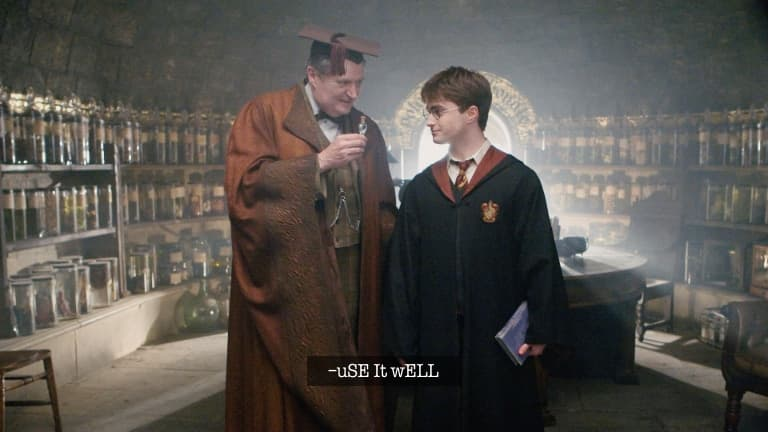

# pasSIVeagGRESSIVEMe
v1.0.0

AlFREd WorKflOw TO AdD a PassIvE-aGgreSsive tONE tO ANY tEXT aS seeN In [thiS instaGRAM ReeL](https://www.instagram.com/reel/CjBBjejAg1r/?=YmMyMTA2M2Y=)

## REqUIREmENTs

[ALfreD fOR MAC](https://www.alfredapp.com/).

## iNStaLLAtion

DOWNlOAD THE [PassiveAggressiveMe.ALfreDWORkFloW](https://github.com/spacenomads/PassiveAggressiveMe/raw/main/dist/PassiveAggressiveMe.alfredworkflow) FILe and DoUBLe CLICK IT!

## USAgE

CoPY aNY pLain TExT, LAunCh aLfrEd, tYpe `pam!` anD HIT eNter. that'S iT, NOW YoU hAVe youR pAssiVE-aGGReSSIvE TONED TEXT in yOur ClIPboArD.

